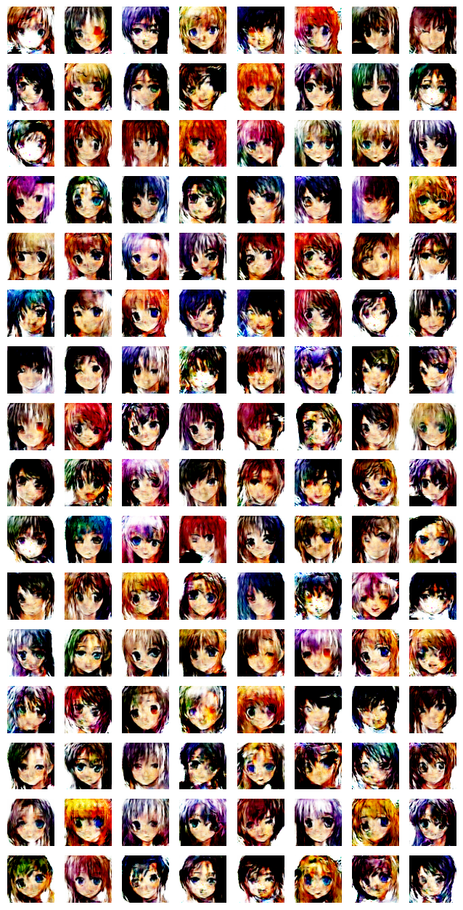

# Anime Character Generation



## Dataset and Resources
- **Dataset:** The GAN is trained on an anime character dataset, a collection of anime character images used to teach the GAN to create similar images.
- **Created By:** Sawan Kumar | April 2024

## Tasks in this notebook
- Architecture of the GAN
- Loading and Preprocessing the Anime Character Dataset
- Defining the Generator and Discriminator Models
- Training the GAN
- Visualizing the Generated Anime Characters

## Setup
This project requires Python 3.7 or above. Install the necessary libraries using:
```bash
pip install pandas numpy packaging scikit-learn tensorflow matplotlib
